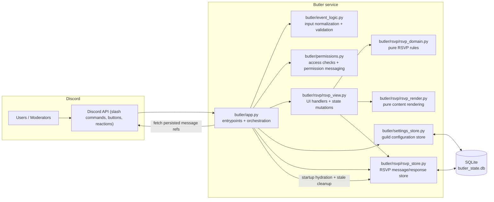

# Butler Discord Bot
Butler creates scheduled Discord events and posts an interactive RSVP message with persistent state, so RSVPs survive bot restarts.

## Architecture graph

## Core behavior
- `/event` creates a scheduled Discord event and posts RSVP content in the configured default channel.
- RSVP content is plain text (no long-lived embed dependency) and can be updated by buttons or reactions.
- RSVP and room state are persisted in SQLite and hydrated on startup.
- Missing persisted Discord messages are cleaned from storage during hydration.

## Module responsibilities
- `butler/app.py`
  - Discord command handlers and event handlers (`/event`, `/seteventchannel`, `/seteventrole`, reaction add/remove, startup hydration).
  - Wires stores, views, permission checks, and event creation flow.
- `butler/rsvp/rsvp_view.py`
  - `discord.ui.View` implementation for RSVP buttons/modals.
  - Persists response changes and room-state transitions via `RsvpMessageStore`.
- `butler/rsvp/rsvp_domain.py`
  - Pure RSVP domain logic (response model, reaction-derived status precedence, counts/mentions helpers).
- `butler/rsvp/rsvp_render.py`
  - Pure render functions for RSVP message text.
- `butler/rsvp/rsvp_store.py`
  - SQLite-backed persistence for RSVP message metadata (`rsvp_message`) and user responses (`rsvp_response`).
- `butler/settings_store.py`
  - SQLite-backed guild settings (default event channel and optional event-manager role).
- `butler/event_logic.py`
  - Normalizes and validates event inputs (time parsing, room URL validation, defaults).
- `butler/permissions.py`
  - Pure and Discord-adapter permission logic for event/room management.

## Setup
1. Install dependencies:
   - `poetry install`
2. Create `.env` from `.env.example`.
3. Configure:
   - `DISCORD_TOKEN` (required)
   - `DISCORD_GUILD_ID` (required for `butler-dev` strict guild sync)

## Required Discord OAuth scopes
- `bot`
- `applications.commands`

## Required bot permissions
- `View Channels`
- `Use Application Commands`
- `Create Events`
- `Send Messages`
- `Embed Links`

For `butler-dev`, these permissions must exist in the guild specified by `DISCORD_GUILD_ID`.

## Required intents
No privileged intents are required for the current slash-command/button/reaction feature set.

## Run
- Normal mode:
  - `poetry run butler`
- Dev mode (strict guild sync):
  - `poetry run butler-dev`

`butler-dev` keeps `/previeweventdesign` available for design iteration in the configured guild.

## Persistence model
All persistent state is stored in SQLite (`butler_state.db` by default, configurable via `BUTLER_DB_PATH`):
- guild settings (`guild_settings`)
  - default event channel id
  - event-manager role id
- RSVP message metadata (`rsvp_message`)
- RSVP user responses (`rsvp_response`)

On startup, Butler hydrates persistent RSVP views and removes stale rows that reference deleted/missing Discord messages.

## Command reference
- `/seteventchannel event_channel:<#channel>`
  - Sets default channel for event and RSVP posts.
- `/seteventrole role:<@role|empty>`
  - Sets/clears role allowed to create events and open/close rooms (in addition to `Manage Server`).
- `/event`
  - Args:
    - `title` (required)
    - `description` (required)
    - `edition` (optional)
    - `room_link` (optional `http://`/`https://`)
    - `start_time` (optional `HH:MM`, default `19:00`)
- `/previeweventdesign` (dev mode/guild sync workflows)
  - Posts RSVP preview without creating a scheduled Discord event.

## RSVP interactions
Buttons:
- `🪓 Jag vill vara med!` (`Available`)
- `🤔 Förmodligen` (`Maybe`)
- `🛌 Kan inte ikväll 😞` (`Cant`)
- `🕒 Kommer senare` (arrival-time modal)
- `📖 Jag vill storytella!` (toggles storyteller role on the response)
- `🔗 ST: Öppna rummet`
- `🔒 ST: Stäng rummet`

Supported reaction defaults on RSVP posts:
- `🪓` → status `Available`
- `🤔` → status `Maybe`
- `🛌` → status `Cant`
- `📖` → storyteller role toggle (independent of status)

Reaction-derived status precedence is deterministic: `Maybe` > `Cant` > `Available`.

## Run with Docker
With Compose:
- `docker compose up --build -d`

Without Compose:
- `docker build -t butler .`
- `docker run --rm --name butler --env-file .env -e BUTLER_DB_PATH=/data/butler_state.db -v butler_data:/data butler`

## Validation
- `poetry run ruff check .`
- `poetry run mypy`
- `poetry run pytest`
- `poetry run python -m compileall butler`
