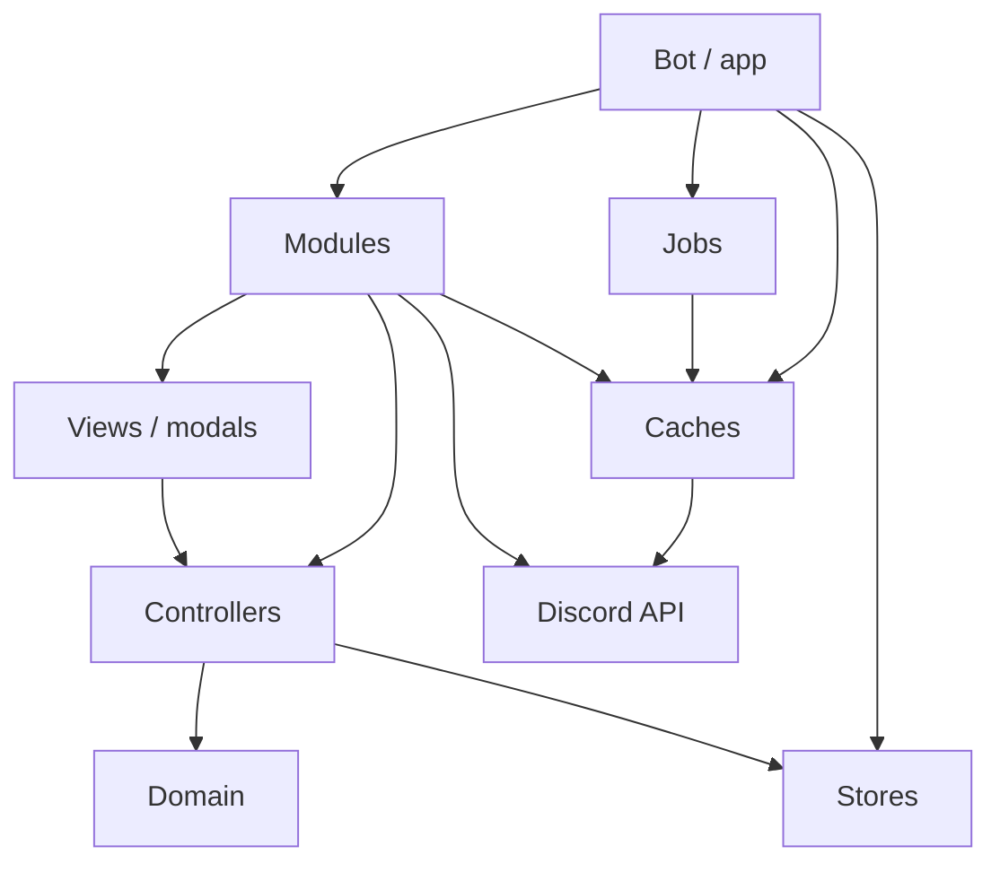
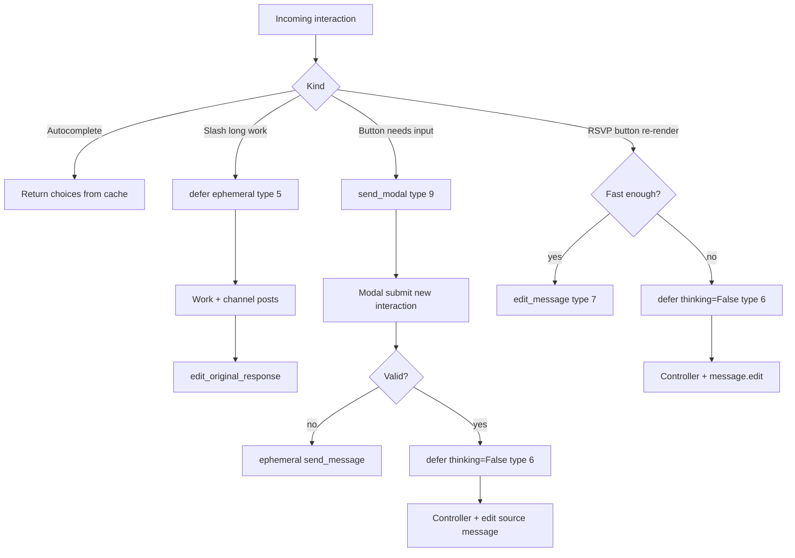
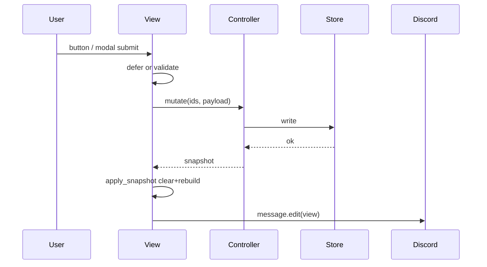
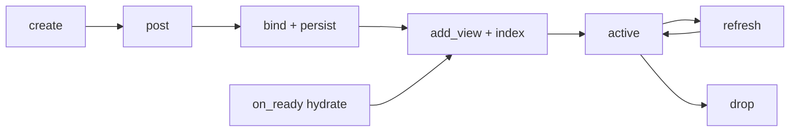

# Architecture

Canonical **target** architecture for Butler, plus a short map of how the mid-rewrite codebase gets there.

Product behavior, copy constraints, and validation commands live in [`agents.md`](agents.md). This document is structural: where code belongs, what may depend on what, and how state moves at runtime.

## Today vs target

| Area | Today (coexistence) | Target |
| --- | --- | --- |
| RSVP UI | `butler/rsvp/*` (`AvailabilityView`, plain content) | `butler/rsvp2/*` (Components V2 `LayoutView`) |
| Domain / types | Duplicated under `butler/rsvp/` and `butler/domains/rsvp/` | Single package `butler/domains/rsvp/` |
| Persistence | `butler/rsvp/rsvp_store.py` (and parallel domain store) | `butler/domains/rsvp/store.py` only |
| Wiring | Globals in `app.py` (`ACTIVE_RSVP_VIEWS`, module-level stores) | `BotWrapper` injector + thin `app.py` |
| Commands | `/event`, settings commands | Same product surface; `/event2` is the rsvp2 path |
| Caches | `butler/caches/events/` package | Boot + gateway + daily warm; interaction reads stay cache-only |
| Jobs | Interval loops inline in `bot_events` | `butler/jobs` (`create_interval_job`) reusable across loops |

Until rsvp2 is feature-complete, both stacks may run. New work lands on the target side.

## Layers

```text
┌──────────────────────────────────────────────────┐
│  Bot (app.py, BotWrapper, bot_events, jobs)      │
│  entry · DI · register modules · lifecycle/jobs  │
└──────────────────────┬───────────────────────────┘
                       │
        ┌──────────────┼──────────────┐
        ▼              ▼              ▼
┌────────────┐ ┌────────────┐ ┌────────────┐
│  Modules   │ │   Caches   │ │   Config   │
│ commands   │ │ events/    │ │            │
│ views      │ │ boot warm  │ │            │
│ modals     │ │ gateway    │ │            │
│ controllers│ │ daily job  │ │            │
└─────┬──────┘ └─────┬──────┘ └────────────┘
      │              │
      ▼              ▼
┌────────────┐    Discord / external APIs
│  Domains   │
│ types      │
│ domain.py  │  (pure, no Discord, no I/O)
│ store.py   │  (SQLite / durable truth)
└────────────┘
```

### Bot

- Process entry, Discord client construction, intent setup.
- Owns the **injector** (`BotWrapper` or successor): config, stores, caches, module registration.
- Lifecycle only: `on_ready` (warm caches, hydrate persistent views, start interval jobs), guild join / onboarding hooks, gateway event hooks.
- Interval work is registered via `butler/jobs` (not ad hoc `tasks.loop` bodies scattered forever).
- **No** business rules and **no** SQL in bot wiring.

### Domains / stores

Per bounded context under `butler/domains/<name>/`:

| File | Responsibility |
| --- | --- |
| `types.py` | Literals and dataclasses (no Discord) |
| `domain.py` | Pure transitions and **policy**: status precedence, room snapshots, mentions, counts, authorization rules |
| `store.py` | Persistence implementing shared `Store`; load/save only |

Domains are not limited to “entity math.” **Core concerns that encode product rules** belong here too—especially **permissions / authorization** (who may create events, open/close rooms, manage guild settings), input normalization that is rule-shaped, and similar pure policy. Shape those APIs over plain data (`has_manage_guild`, role id sets, configured role id), not `discord.Member`.

Pattern (already sketched in legacy `permissions.py`):

- **Domain (pure):** `can_manage_events(has_manage_guild=..., member_role_ids=..., event_manager_role_id=...)`
- **Edge adapter (module / discord helper):** project `discord.Member` / channel perms onto that pure function, format user-facing denial copy with `design.py`

Shared multi-context policy may live as `butler/domains/<concern>/` (e.g. `domains/permissions/` or under the owning context such as `domains/rsvp/` if it is RSVP-specific only). Prefer a dedicated domain package when more than one module needs the same rules.

Stores are durable truth for domain data. Domain packages do not render UI and do not import `discord`.

### Caches

In-memory projections of **external** data (Discord scheduled events, etc.). Not a substitute for domain stores.

Scheduled events live in package **`butler/caches/events/`** (import surface still `butler.caches.events`). Rough module split:

| Module | Role |
| --- | --- |
| `store.py` | Process-local maps, TTL stamps, upsert/drop/reset |
| `constants.py` | TTL, autocomplete caps, timezone |
| `recurrence.py` | Weekly recurrence matching / occurrence dates |
| `reusability.py` | “Pickable today?” policy + choice labels/sort |
| `listing.py` | Guild list / fetch-by-id |
| `autocomplete.py` | Slash autocomplete (cache-only; optional background warm) |
| `resolve.py` | Selected / cached / lookup resolution |
| `warmup.py` | Boot, daily, and cold-path hydrate |
| `gateway.py` | Live create/update/delete patches |
| `urls.py` | Event / preview URL builders |
| `__init__.py` | Stable public re-exports |

Warmth model (preferred over blocking refresh inside interactions):

- **Boot** (`on_ready`): `warmup_connected_event_cache(guilds=…, force=True)` **before** slash command sync so autocomplete is hot within Discord’s ~3s budget.
- **Daily job**: `create_interval_job` every 24h, `force=True`, **skips the first tick** because boot already hydrated.
- **Guild join**: force warm that guild once.
- **Gateway** scheduled-event create/update/delete: patch the in-memory options without a full list.
- **Autocomplete / modal options**: read the cache only. If cold, schedule a **background** warm and still return immediately (create-new + whatever is cached).

Empty / missing cache is an explicit degraded result; the module decides UX (create-new only, ephemeral empty message, etc.).

Do **not** use open-ended reflection (`getattr` / probing private Discord internals) in cache code unless there is no public API and the approach is explicitly accepted. Prefer typed public attributes and confining any private HTTP adapter to one place (e.g. recurrence fetch adapter).

### Jobs

Long-running interval work lives under **`butler/jobs/`**, not as one-off loops buried only in feature modules.

- `create_interval_job(name=…, get_bot=…, run=…, hours|minutes|seconds=…, skip_first_iteration=…)` builds a `discord.ext.tasks` loop with `wait_until_ready` and optional skip of iteration 0.
- `IntervalJob` exposes `start` / `stop` / `cancel` / `is_running` for lifecycle and tests.
- First consumer: daily scheduled-event cache resync from `bot_events`.
- Additional jobs should reuse this helper rather than copying loop boilerplate.

### Modules

Feature packages that own Discord surface area: slash commands, views, modals, reaction handlers, and **controllers** (application services).

Example target module: `butler/rsvp2/` — controller, LayoutView, modals, command handlers. Modules call domain + stores + caches through injected dependencies. They own ephemeral replies and **Discord-facing** permission checks (extract flags/ids from the interaction, call pure domain policy, send denial messages).

Shared presentation constants stay in `butler/design.py`. Thin Discord I/O helpers (fetch message, resolve channel) stay outside domains. Do **not** leave pure policy (permissions, RSVP rules, room transitions) in top-level grab-bag modules long term—move them into `butler/domains/...`.

## Dependency rules

### Allowed

| From | To |
| --- | --- |
| Bot / `app` | Modules, stores, caches, jobs, config |
| Modules | Domain, stores, caches, design, discord helpers |
| Controller | Store, domain (ids in, snapshots/outcomes out) |
| Views / modals | Controller (not store directly) |
| Domain | Types + design constants only (includes pure permission/policy helpers; no Discord) |
| Stores | Domain types only |
| Caches | Discord/API (+ optional read-only helpers); no UI |
| Jobs | Bot factory + async run body; may call caches/modules, not views |

### Forbidden

- Views or modals talking to SQLite / stores
- Domain importing `discord` or doing I/O
- Growing business handlers in `app.py`
- Controllers depending on `discord.ui` view/modal types (avoid `Interaction` on the controller API when practical)



## Interaction budget

Discord requires an initial interaction response within **3 seconds**.

- Treat **~2.0–2.5s** as the maximum wait for optional work so the handler still has time to build and send the response.
- Prefer `defer` early when controller + re-render may approach the limit (after validation errors that need an immediate ephemeral reply).
- Opening a **modal** must be the button handler’s **first** response (`send_modal`); do not defer before that.
- **Event option reads inside interactions must not await a full guild event list.** Rely on boot/gateway/daily warmth; if cold, return cache (possibly empty aside from create-new) and warm in the background.
- After a successful initial ACK, the interaction **token** remains usable for roughly **15 minutes** for followups and edits. Work that can outlive that window needs its own job/state and ordinary channel message APIs—not the interaction token alone.

## Interaction responses and defer

Every slash command, component click, and modal submit is a separate interaction. It gets **exactly one** initial callback via `interaction.response`. Further output uses `edit_original_response`, `followup`, or `message.edit`.

### Callback types (API → discord.py)

| API type | Name | discord.py (typical) | UI effect |
| --- | --- | --- | --- |
| 4 | Channel message | `response.send_message` | Reply now |
| 5 | Deferred channel message | `response.defer(...)` when type 5 applies | “Thinking…” placeholder reply |
| 6 | Deferred message update | `response.defer(thinking=False)` on component/modal | Silent ACK; edit source message later |
| 7 | Update message | `response.edit_message` | Edit source message immediately |
| 8 | Autocomplete result | autocomplete callback | Choices only |
| 9 | Modal | `response.send_modal` | Open modal (must be first response) |

### `response.defer` mapping in discord.py

| Interaction | `thinking=False` (default) | `thinking=True` |
| --- | --- | --- |
| Application command (slash) | Type **5** thinking reply | Type **5** thinking reply |
| Component (button/select) | Type **6** silent message-update ACK | Type **5** thinking reply |
| Modal submit | Type **6** silent message-update ACK | Type **5** thinking reply |

- **`ephemeral=True`** only affects defers that create a **type 5** message (slash always; component/modal only when `thinking=True`). With type **6**, ephemeral does not create a hidden placeholder.
- After type **5**, clear the thinking state with **`edit_original_response`** (preferred). You own making that placeholder go away.
- After type **6**, there is no thinking message—continue by editing the source message (`interaction.message.edit` / equivalent).
- A second `response.*` call raises `InteractionResponded`.

### Butler defaults (rsvp2)

| Action | First response | Then |
| --- | --- | --- |
| Slash create/settings that may run long | `defer(ephemeral=True)` (type 5) | Work; public posts via channel APIs; `edit_original_response` status |
| RSVP button → re-render post (normal path) | `defer(thinking=False)` (type 6) **or** fast `edit_message` (type 7) | Controller write → `apply_snapshot` → `message.edit(view=…)` |
| RSVP button → need user-visible progress | `defer(thinking=True, ephemeral=True)` (type 5) | Edit RSVP message + `edit_original_response` to clear thinking |
| Button opens modal | `send_modal(...)` only | Button interaction ends; no defer on that interaction |
| Modal validation error | `send_message(..., ephemeral=True)` (type 4) | Stop |
| Modal success → update RSVP post | `defer(thinking=False)` (type 6) | Controller → edit `interaction.message` (set when modal opened from a component); optional announce |
| Autocomplete | Return choices immediately from cache | **No** defer; never list-events on this path |
| Work beyond ~15 minutes | Short defer/reply “started” | Background task + channel edits; do not rely on the token |

**Type 5 vs 6 matters:** type 5 makes “original response” a **new** reply/thinking message. Type 6 keeps the path aimed at the **source message**. For RSVP LayoutView updates, prefer type **6** or type **7** so you do not accidentally treat a thinking reply as the RSVP post.

### Hard rules

1. One initial `response.*` per interaction.
2. Cannot `defer` then `send_modal` on the same interaction (or the reverse after responding).
3. Opening a modal **consumes** the button interaction; submit is a **new** 3s / ~15min budget.
4. Defer only buys time inside the token window—it is not a job queue.
5. Reactions are gateway events, not interactions: no defer; resolve view from the ephemeral index / store and edit the message directly.



## Runtime state model

| Kind | Role | Example |
| --- | --- | --- |
| **Durable** | Source of truth for RSVP posts and responses | SQLite `rsvp_message`, `rsvp_response` |
| **Ephemeral index** | Fast routing to a live view instance | `message_id → EventMessageView` |
| **Caches** | Boot-/gateway-/job-warmed external projections | Guild scheduled event options (`caches/events`) |
| **Render snapshot** | Immutable input to pure render / `apply_snapshot` | View state + responses (+ derived room buttons) |
| **Companion messages** | Extra channel messages owned with a post (not LayoutView children) | Bare scheduled-event URL message id on `ViewState.event_card_message_id` |

Hydration on ready:

1. Warm event cache (`force=True`) **before** publishing slash commands.
2. Start interval jobs (e.g. daily event-cache resync; first tick skipped when boot already hydrated).
3. `store.list_messages` → for each row, confirm the Discord message still exists (legacy and/or rsvp2 stacks as wired).
4. Recreate view, `bot.add_view(..., message_id=...)`, insert into the ephemeral index.
5. Delete store rows for missing messages (orphans).

## Controllers

Controllers are application services inside a module. They orchestrate store + domain and return data the UI can render.

`RsvpController` (target responsibilities):

- Load render snapshot for a message
- Set / clear RSVP status and role
- Set arrival time
- Open / close room via domain `RoomSnapshot` (authorization **decision** from domain policy; module supplies ids/flags from the interaction and sends denial UX)
- Persist message metadata (`ViewState`) on bind and updates

Prefer APIs shaped like `(message_id, user_id, …) -> snapshot | outcome`, not Discord interaction objects.

## Views, lifecycle, and re-rendering

Views are **projectors and interaction adapters**, not sources of truth.

### Lifecycle

```text
create → post → bind → register → active ⇄ refresh → drop
                              ↑
                     boot hydrate from store
```

| Phase | Responsibility |
| --- | --- |
| **Create** | Module builds initial `ViewState` and constructs the view with injected controller; persistent posts use `timeout=None` |
| **Post** | For linked scheduled events: post **companion** bare event-URL message first (native Discord event card), then the LayoutView RSVP message; store companion id on view state |
| **Bind** | Record `message_id` / `channel_id` / `guild_id` (and companion card id when present); controller upserts durable message row |
| **Register** | `bot.add_view(view, message_id=…)` and `active_views[message_id] = view` |
| **Active** | Buttons, modals, and reactions route to the live instance (or a hydrated one) |
| **Refresh** | After every successful mutation (see below) |
| **Drop** | Message gone or explicit delete: remove index entry, delete store row, stop routing |

Ephemeral previews may skip bind/register/store when they never become guild posts.

### Re-render rules

1. Controller writes durable state first.
2. Load a **full** render snapshot from the controller/store (do not trust a long-lived partial copy after concurrent updates).
3. `apply_snapshot(snapshot)`: **`clear_items()` then rebuild children** — render must be idempotent (never stack `add_item` on stale children).
4. `message.edit(view=view)` (LayoutView carries visible UI in components).
5. Hold a **per-`message_id` asyncio lock** around mutate + refresh so concurrent clicks/reactions serialize.
6. Prefer **keeping the same Python view instance** across refreshes. If the instance is replaced, re-`add_view` and update the index under the lock.
7. Every persistent button needs a **stable `custom_id`** so clicks work after process restart.
8. Room action visibility comes from domain (`visible_room_buttons`) during render, not ad-hoc toggles scattered in handlers.





### Modals

Modals are thin module UI shells (same layer as buttons), not a second business layer. Response choices follow [Interaction responses and defer](#interaction-responses-and-defer).

- One modal class per input use case (e.g. arrive-later time, open-room URL); share copy via `design.py`.
- **May**: collect fields, light parse/normalize, permission check at the edge, call controller, drive Discord response / re-render.
- **Must not**: open SQLite, own domain transitions, hold a fat view graph (prefer a small context: ids + controller).
- Button path: first response is `send_modal` (consumes the button interaction).
- Submit path: validate → ephemeral `send_message` on error, else `defer(thinking=False)` (type 6) → controller → edit source `interaction.message` → optional announce after state is durable.
- Do not use `thinking=True` on modal submit when the goal is updating the RSVP post—that makes “original response” a new reply instead of the source message.
- Close-room stays a button unless a confirm modal is introduced later.

### Naming (target code)

Follow PEP 8 for new/moved code:

- Modules/files: `snake_case.py` (`event_message_view.py`, not `EventMessageView.py`)
- Classes: `PascalCase`
- Functions, args, attributes: `snake_case` (`view_state`, not `viewState`)
- Constants: `UPPER_SNAKE`
- Prefer stdlib `dataclasses` for domain/UI snapshots unless there is a concrete reason not to

`rsvp2` is an acceptable migration package name until legacy `rsvp` is removed.

## Reference module: RSVP

Target flow using `rsvp2` + `domains/rsvp`:

1. Slash command validates input and permissions (pure rules from domain modules; Discord adapters at the command edge).
2. Create or link a Discord scheduled event as needed (picker/autocomplete reads go through `caches/events`, already warmed).
3. Build initial `ViewState` (includes optional `event_card_message_id` once the companion message exists).
4. If linked to a real scheduled event: post **companion** bare `https://discord.com/events/…` message (native event card only — not inlined as LayoutView content), track its message id, then post the LayoutView RSVP message.
5. Bind + register; ephemeral index for routing; domain store remains durable truth.
6. Buttons / reactions / modals → controller (`ServiceResult`) → view `match` → `apply_snapshot` → edit RSVP message; relink updates or recreates the companion card message via stored id.

Architecture-shaping product constraints (details in `agents.md`):

- **Companion message only** for the native scheduled-event card (no classic embed on the LayoutView; no duplicate embed-like container inside the RSVP message)
- Explicit reaction status precedence
- Discord **Storyteller role / event-manager permission** is not the same concept as RSVP role `Storyteller`
- Missing cosmetic assets (edition emoji/logo) must not block post or edit

## Target package layout (illustrative)

```text
butler/
  app.py                      # thin entry + command registration
  bot_wrapper.py              # injector (target)
  bot_events.py               # lifecycle, gateway hooks, start jobs
  design.py
  config.py
  constants.py
  discord_helpers.py          # Discord I/O adapters only
  jobs/
    interval.py               # create_interval_job / IntervalJob
  domains/
    rsvp/
      types.py
      domain.py               # RSVP/room pure rules
      store.py
    permissions/              # or fold into owning contexts if preferred
      domain.py
    result.py                 # Ok / Err service results
  caches/
    events/                   # scheduled-event option cache package
      __init__.py             # public re-exports
      store.py
      warmup.py
      gateway.py
      autocomplete.py
      resolve.py
      listing.py
      …
  rsvp2/                      # module (name may collapse to rsvp later)
    controller.py
    event_command.py
    runtime.py                # hydrate / reaction reconcile
    view/
      event_message_view.py
      body.py
      event_select.py
    modals/
      arrive_later.py
      room_link.py
      select_event.py
```

## Migration (architecture-facing)

- **Old**: `butler/rsvp/*`, legacy store, `AvailabilityView`, `/event`
- **New**: `butler/domains/rsvp/*`, `butler/rsvp2/*`, `/event2` → full command parity with legacy before delete
- Event cache package + `butler/jobs` interval helper are **in place**; keep public `butler.caches.events` imports stable
- Collapse duplicate types/domain/store to `domains/rsvp` as soon as rsvp2 is the only writer/reader
- Wire rsvp2 **hydration** and **reaction reconcile** into `bot_events` (parity gaps vs legacy) before removing `rsvp/`
- Finish `BotWrapper` as the owner of stores, caches, jobs, and module setup; keep `app.py` as wiring + command registration only
- Do not use this rewrite as an excuse to churn `design.py` copy unless structure requires it
- Delete legacy `rsvp/` only after behavior parity (including hydration, reactions, room flow, settings integration, companion event card)

## Out of scope for this document

- Line-by-line inventory of every legacy helper
- Swedish user-facing copy samples and full test checklists (see `agents.md`)
- Wall-clock cron semantics for jobs (interval-from-start is enough until a product requirement says otherwise)
