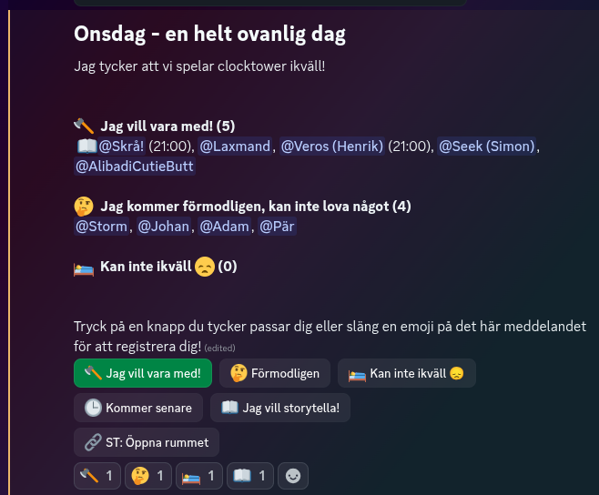

# Architecture

## Extensible

* Domains/Stores - persisted data stores with contextual domain data
* Caches - in-memory caches, to be lazily hydrated (in a separate thread if caller cancels)
* Modules - Contained business logic

## Bot

* Global state and injector
* Constructs discord bot and registers modules

